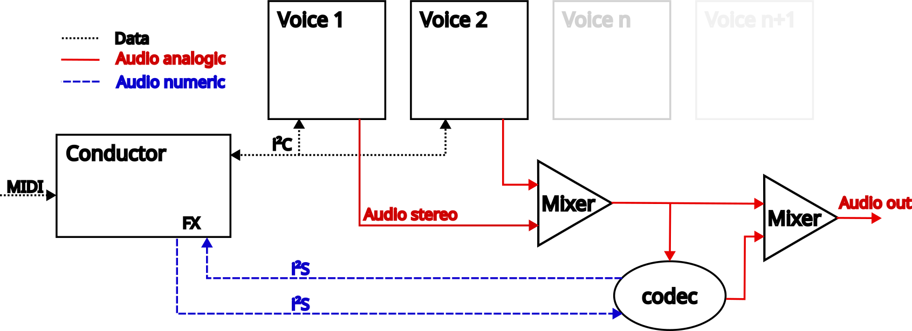

# polyUAnalog: A Polyphonic Analogic and *Open Source* Synth

## Project Overview

The architecture of polyUAnalog centers around a simple design: a *conductor board* orchestrating multiple *voice boards*. This modular approach allows each board to function independently as a monophonic synthesizer. When combined under the guidance of the conductor board, they form a versatile polyphonic synthesizer capable of operating in various modes:

- **Polyphonic Mode**: Achieve polyphony with up to virtually 120 voices. Our current configuration supports 10 voices of polyphony, tested and functioning seamlessly.
- **Monophonic with Unison and Spread Mode**: For those moments when a single, powerful voice is needed, enhanced with unison and spread capabilities for added depth.
- **Multi-timbral Mode** (Under development as of April 2024): Expanding the synth's versatility by allowing multiple timbres to be played simultaneously.

## Repository Structure

The `polyUAnalog` repository is organized into two main directories, `firmware` and `hardware`, each containing subdirectories dedicated to different components of the synth:

### Firmware
Contains all necessary code to bring the polyUAnalog to life. This includes the microcontroller programming for voice and conductor boards, as well as the controller interface.

- **Voice Board**: The soul of the polyUAnalog's sound, each voice board is an independent monophonic synthesizer.
- **Conductor Board**: The brain behind the operation, orchestrating the voice boards to work in harmony.
- **Controller**: Interface and panel design for hands-on control of the polyUAnalog.

### Hardware
Detailed schematics, PCB designs, and everything required to physically construct the polyUAnalog synth.

- **Voice Board**: Designs and instructions to build each monophonic voice board.
- **Conductor Board**: The blueprint for constructing the central conductor board.
- **Controller**: Panel design and schematics for the physical user interface.

For specific details on each component, please refer to the corresponding `README.md` file within its directory. Our aim is to make the assembly and understanding of the polyUAnalog as accessible as possible.

## Contributing

polyUAnalog thrives on community input and collaboration. Whether you're a seasoned electrical engineer, a software developer with a knack for DSP, or an enthusiast eager to learn and explore, your contributions are welcome. 

## Academic Research and Publications

We have documented our journey and findings in a comprehensive academic paper. This paper delves into the theoretical underpinnings, design choices, and technical challenges encountered during the development of polyUAnalog. While the paper is currently in draft form and distributed as-is, we believe it provides valuable insights into the project's scientific and engineering aspects.

A DOI and access to the official publication will be provided upon acceptance. Additionally, a pre-print version of the paper will be made available to ensure our findings are accessible to the community, fostering further research and development in the field of analog synthesis.

## Sound Examples

We are currently compiling a diverse range of audio samples to showcase the versatility and musicality of polyUAnalog. This is a work in progress, and we appreciate your patience as we curate a collection that truly represents the essence of this project.

Stay tuned for a SoundCloud link, which will be shared here soon. 

## Project Progress

| Task               | Description                                    | Status       |
|--------------------|------------------------------------------------|--------------|
| Documenting    | Drafting an explanation of the synth's electronics and detailing the functionality of the code.      |  In Progress |
| Multitimbral          | Add multitimbral capability by adapting the software.  |  Almost OK ! |
| Faster PID   | Transitioning from the hardware RC-based Timer of the RP2040 to the PIO ones to achieve a faster response time of the DCO waveform.   |  Testing |
| Conductor board | Design and finalize the electronic, PCB, and firmware layout for the conductor board, which enables the control of voice cards, connects to an FX board, and one or multiple controllers.|  Pending |
| FX Loop | Testing the V4220 codec chip.|  Pending |
| Controler | Finishing the first controler : the "basic synth" |  Pending |

| Finishing the paper | Last measurements still to be done |  Pending |

## License

polyUAnalog is open source and distributed under the MIT License. 

