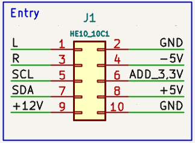

# BUS Card

## Overview
The **BUS Card** is the interface designed to link multiple voice boards to the Conductor module. 

- **Capacity:** Each BUS board supports up to 4 voice boards.
- **Mounting:** Voice cards are mounted vertically to optimize space.

## Connectivity & Expansion
You can daisychain multiple BUS boards using two different methods:
1. **Ribbon Cable:** Use a standard 2x5 (2.54mm pitch) connector, similar to Eurorack power cables.
2. **Tiling:** Align the boards side-by-side and solder the dedicated edge pads for a rigid connection.

## Input Connector
The pinout and format of the input connector are detailed in the following diagram:

## I2C Addressing
The I2C address is determined by the voltage level at the `ADD_3.3` pad. 

To configure the addressing:
- Install resistors in series between each card.
- Connect the resistor pin of the first card to **GND** (Ground) to complete the voltage divider.
- The resulting voltage drop across the chain assigns a unique hardware address to each board.