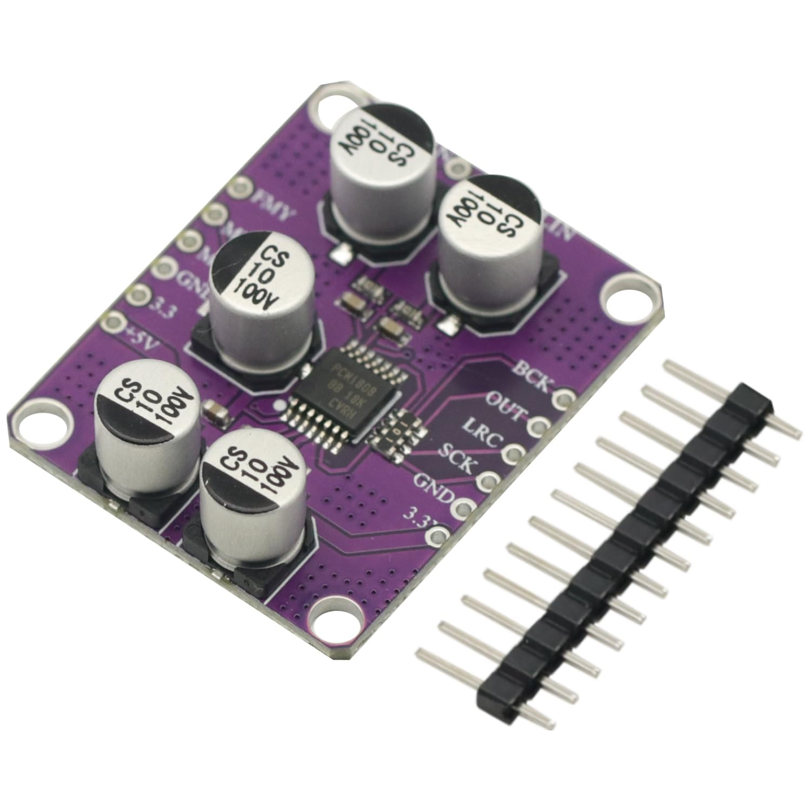

## FX Board

We designed an optional, dedicated FX card based on the **RP2350** microcontroller to handle digital effects. This board connects to the conductor board via a standard 2x5 pin header. Audio input and output data transfer relies on the **I2S protocol**, implemented utilizing the RP2350's Programmable I/O (PIO) blocks.

To accommodate different budgets and assembly constraints, the card supports three ADC and DAC configurations:

* The first approach uses the RP2350's **built-in ADC** paired with a $2 \times 8$-bit PWM-RC filtered DAC for the output.
* The second option employs inexpensive, off-the-shelf **I2S ADC (PCM1808) and DAC (PCM5102A)** modules. While we have included the footprints on the PCB to allow for discrete mounting or to future-proof against discontinued supply, we strongly recommend using the modules themselves.
* The third configuration integrates the **Coolaudio V4220 codec**. This recent and cost-effective chip comes in an SSOP-28 package, making it significantly easier to hand-solder than the QFN packages typical of modern audio codecs. It is worth noting that the V4220 datasheet is poorly documented, as it confusingly mixes specifications from the original Cirrus Logic CS4220 and CS4221 chips it is based on.

