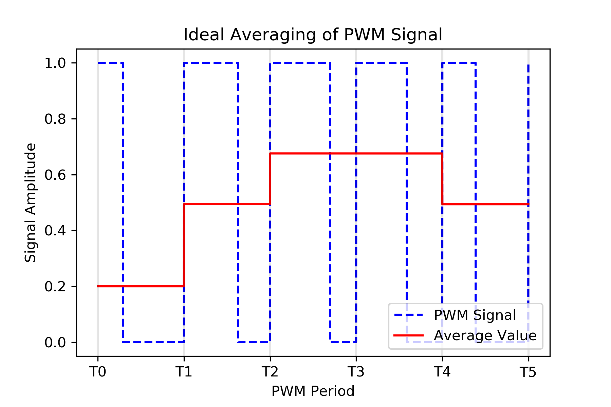
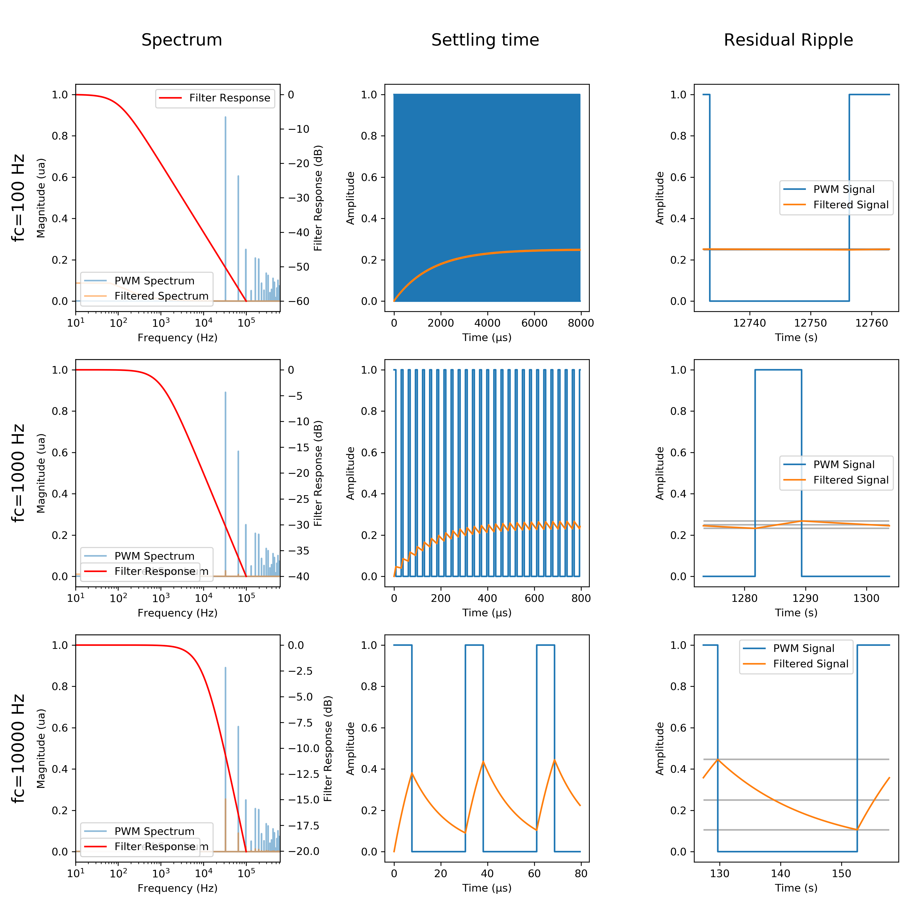

# Pulse Width Modulation (PWM) as a Digital-to-Analog Converter (DAC) with Low Pass Filtering
 
## The main idea

Pulse Width Modulation (PWM) is a widely used technique for controlling analog circuits and systems using digital signals, that is to say only capable to produce two voltage values. In PWM, a square wave is generated with a constant frequency, while its duty cycle is modulated to represent the desired control signal.     

Taking the average value of a PWM signal can be used to create a Digital-to-Analog Converter (DAC), as the varying duty cycle directly affects the average output voltage. A practical example of this principle can be seen in LED dimming, where PWM modulation is used to control the intensity of the light. Our persistence of vision serves as the averaging device, as our eyes perceive the time-averaged intensity of the rapidly blinking LED, rather than the individual on and off states. This technique, applied in the ideal case, is illustrated in fig. X, demonstrating how the average value of a PWM signal can be used to create a DAC and control the output voltage.

*Figure X Graphics showing that the mean value of a PWM signal *

*Figure X Graphics showing that the mean value of a PWM signal * 

## Dual PWM

## More maths

## Standard Hardware implementation of PWM

PWM signals are often implemented in hardware using timers and Output Compare Registers (OCRs). A timer is a hardware component that continuously counts up or down at a specific rate based on the input clock frequency. The timer's value resets to the initial value when it reaches the maximum count or overflow.

An Output Compare Register is a hardware register that stores a predetermined value. The timer's value is continuously compared to the value in the OCR. When the timer's value matches the value in the OCR, an output signal is generated, usually in the form of a change in the state of a specific output pin (e.g., from high to low or vice versa). By changing the value stored in the OCR, the duty cycle of the resulting PWM signal can be controlled.

The precision of a PWM signal is ultimately based on time measurement. The resolution of the timer and the input clock frequency determines the granularity of the time measurement, which in turn affects the accuracy and precision of the PWM signal's duty cycle. A higher-resolution timer or a faster clock frequency will result in more precise control over the PWM signal's duty cycle, allowing for a more accurate representation of the desired analog output.

Phase correct Pulse Width Modulation (PWM) and Fast PWM are two commonly used modes for generating PWM signals with different characteristics. The primary difference between these two modes lies in the way the Output Compare Register (OCR) is managed, which affects the PWM waveform.