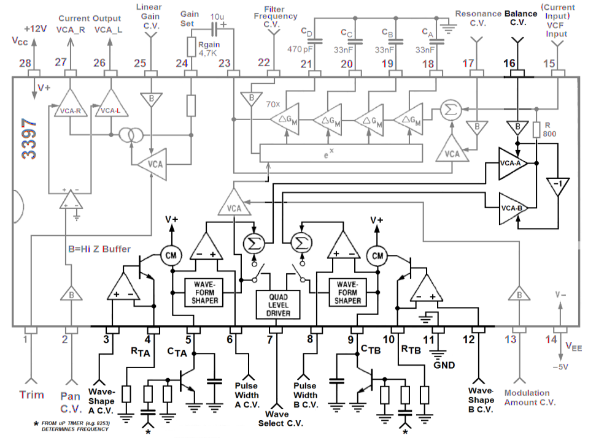

# Deep Dive into the VCO Part of the Chip

*Figure 1. Schematic Diagram of the AS3397 with Focus on the DCO Section*

## Digitally Controlled Oscillator (DCO)

The AS3397 features two oscillators that are of the DCO type. The operation of this type of oscillator is particularly well described in [Stargirl Flower's blog post on the oscillators of the Juno 6](https://blog.thea.codes/the-design-of-the-juno-dco/).

An oscillator must, almost by definition, produce a periodic signal. Here, it is obtained by charging a capacitor followed by its abrupt discharge. The discharge is triggered by a pulse from a digital circuit (typically a microcontroller in 2024). If the discharge signal is periodic, then the voltage across the capacitor will have the same periodicity, and we indeed have an oscillator.

### Charging a Capacitor with Constant Current

The heartbeat within the oscillator is the charging of a capacitor with charges. Charging a capacitor might spontaneously make you think of an exponential curve that reaches the charging voltage after a time $\tau=RC$. Indeed, this is what happens when the capacitor is charged with a *constant voltage*. The more the capacitor is charged, the more it opposes the increase in its charge until reaching a status quo where the charging voltage equals the voltage generated by the charges accumulated on the capacitor's walls. This would be analogous to filling a water bottle that is upside down (i.e., with a neck pointing towards the ground into which a pipe delivering water comes). As the level rises, the hydrostatic pressure opposes the filling of the bottle until it equals the pressure in the pipe at the entrance of the neck.

*Figure 2. Charge of a condensator at constant voltage vs constant current*

Here, the charging of the capacitor is not at constant voltage but at *constant current*. Continuing the analogy started above, this is akin to filling a bottle "normally", i.e., without it being upside down. The water level inside the bottle increases linearly with time since nothing prevents its filling. Returning to the capacitor, when it is charged with constant current, its voltage increases linearly across its terminals. We thus obtain a voltage ramp over time.

#### The AS3397's Current Source

A very classic way to obtain a constant current charge of a capacitor is to include it in a feedback loop of an OpAmp whose linearity condition (V+=V-), forces the current to be constant within the RC series circuit.

The principle schematic of the AS3397 suggests that the chip uses another system to obtain a current source, namely a transistor placed in the feedback loop followed by a current mirror (CM).

As mentioned earlier, the operational amplifier in its linear regime acts to maintain a constant voltage difference between its inputs (positive and negative terminals). In the context of a current generator, a reference voltage is typically applied to one of the op-amp's inputs (here the + input). Here, this voltage is "WaveShape CV", noted $V_{wf}$ which, as its name indicates, will play a crucial role in controlling the waveform of the oscillator.

The resistor $R_{TA}$ sets the current. ([Reference](http://www.ecircuitcenter.com/Circuits/curr_src1/curr_src1.htm))

The other input of the op-amp, here the - input, is connected to ground via the resistor $R_{T}$, so that the linear operation of the OpAmp forces the voltage across $R_{T}$ to be equal to $V_{wf}$. The current within $R_{T}$, which is also the same as the one that will serve as input to the current mirror, is $I = V_{wf}/R_{T}$.

The OpAmp's feedback loop contains a transistor. More specifically, the OpAmp's output is connected to the transistor's base, and the output voltage of the OpAmp thus controls the current flowing between the base and the emitter. Indeed, the base-emitter part of the transistor (here NPN), behaves like a diode where the base current $I_{B}$ varies exponentially with the base-emitter voltage $V_{BE}$. Furthermore, the collector current $I_{C}$ traversing the transistor, which is the same as the current $I$ traversing $R_{T}$, depends linearly on the base current (via the current gain $\beta$). In total, a modification of the OpAmp's output voltage translates into a modification of the base voltage $V_{BE}$ and thus of the collector current $I_{C}$ which traverses $R_{T}$. The operation of the OpAmp requires the simultaneous achievement of two conditions:
- The voltage across $R_{T}$ must be equal to $V_{wf}$, setting a current $I=V_{wf}/R_{T}$
- The OpAmp's output voltage, which drives the transistor via its base, must be such that the current in the collector also equals $I$

In summary, the choice of the $V_{wf}$ voltage and the $R_{T}$ resistor sets a stable current $I$ that, at least in theory, does not depend on the load in which the current flows. Thus, we are indeed dealing with a current generator. The load is typically placed between the collector and the base of the transistor. The AS3397 uses a current mirror before sending this copy of the current to the capacitor to be charged.

##### Explanation of a Current Mirror

The somewhat schematic view of the AS3397 does not allow us to know the exact nature of the current mirror used here. Nevertheless, we can revisit the principle of a current mirror by taking the simplest example: connecting two transistors, T1 and T2 (as identical as possible), in the manner presented in Figure X. Since the two transistors share the same voltage between the base and the emitter, the output current passing through the collector of T2 is the same as the input current passing through the collector of T1.

https://www.analog.com/en/resources/analog-dialogue/articles/current-output-circuit-techniques-add-versatility.html

Transconductance amplifier

SChéma en Falstad

### Capacitor Discharge

In a DCO, the capacitor must be discharged at a frequency that defines the pitch of the note to be played. The AS3397 follows the traditional scheme, which involves using a transistor acting as a switch controlled by the microcontroller. If the control voltage sent to the base of the transistor is zero, the transistor remains open, and the capacitor charges from the current source. If the control voltage rises to a high level (here 3.3V), the transistor closes, connecting both terminals of the capacitor to the ground, causing it to discharge almost instantly.

The arrangement shown in the AS3397 datasheet includes some additional components. The discharge pulse (symbolized by a star) first passes through a high-pass filter acting as a derivative filter. Indeed, the discharge pulse must have the correct duration, specifically:
- Not too short, to ensure the capacitor fully discharges.
- Not too long, to allow the capacitor to begin charging again as soon as it is empty.

TODO: Create a diagram.

Typical components from the 1980s produced pulses that were too long, and the derivative filter was intended to create a shorter pulse. Perhaps as a reminder, a high-pass RC filter acts as a differentiator when the frequency of the signal (its fundamental) is much higher than the cutoff frequency. The transfer function is then simply \( H(\omega) = j\omega \), that is, the operation of deriving the signal.

Nowadays, the derivative assembly is no longer very useful because the pulses produced by microcontrollers can be particularly short. For example, with the RP2040 @ 125MHz, pulses can have a duration of 8ns.

After the derivative RC filter, there is a resistor before the base of the bipolar transistor intended to ensure that, given the voltage of the pulses, the base current is sufficient to open the transistor.

In an effort to reduce the number of components, we have chosen to simplify this part of the assembly:
- By removing the derivative part and directly setting the adequate duration of the pulses generated by the RP2040.
- By using a MOSFET transistor instead of a bipolar one, allowing it to be driven directly by voltage and eliminating the need for the bias resistor.

We have chosen the BS170 transistor, which is easy to source, very inexpensive, and especially has a Gate Threshold Voltage (VGS(th)) of about 2V, which is below the 3.3V, ensuring that the 3.3V pulses from the RP2040 can trigger its opening.

Note that the resistance of the BS170 when open (Static Drain−Source On−Resistance, typically noted as RDS(ON)) is not negligible and is about 1.5 Ohms here. This should be taken into account during the discharge of the capacitor and makes this process less instantaneous. Figure x shows the time required for the total discharge of the capacitor. This figure also indicates that the duration of the pulse fully allows the capacitor to discharge completely, even considering the increased time due to this residual RDS(ON) resistance.

## Wave Shaper and Waveform Control

As previously mentioned, the DCOs allow for a perfectly fixed frequency (without the need to worry about the exponential voltage-to-frequency converters, as this is managed by software in the microcontroller). However, this introduces a challenge: the amplitude of the voltage ramp generated depends on the frequency. Indeed, the capacitor's charge time for low frequencies is longer than for high frequencies. Thus, all else being equal, the voltage reached by the ramp—and consequently, the volume of the VCO—is higher at lower frequencies than at higher frequencies.

TODO: Add a graph for explanation before and after charging voltage control.

This problem is particularly critical because, in the AS3397 chip, the voltage ramp passes through a wave shaper circuit to provide a broader range of waveform shapes.

### Description of the Wave Shaper

For now, setting aside the management of the ramp amplitude, let's focus on the wave shaper. The datasheet does not describe its internal components but provides an operational summary which is illustrated in Figure X for a supply voltage of 12V to the AS3397.

For lower ramp voltages, the wave shaper behaves linearly, and the output waveform remains a sawtooth. For voltages between XV and YV, the wave shaper reverses the direction of the ramp, resulting in a complete rising ramp followed by a portion of a descending ramp. At a ramp voltage of ZV, the descending part lasts as long as the ascending part: we obtain a triangular wave. For ramp voltages above ZV, the wave shaper transforms it into a zero voltage. Thus, the output waveform is what the datasheet describes as a "clipped" triangle. Beyond ZV, the zero-voltage portion of the waveform increases, and we approach a pulse.

Controlling the maximum ramp voltage output from the capacitor leads to two requirements:
- It must be the same for all frequencies, otherwise, the waveform (i.e., the timbre) will not be the same from one note to another.
- The maximum ramp voltage of the capacitor must be adjusted to achieve the desired waveform output from the wave shaper.

### How to Adjust the Maximum Ramp Voltage?

We need to focus on what conditions the maximum value of the ramp voltage. This value is obtained by multiplying the slope of the line by the charge duration. The charge duration is easy to know—it's the inverse of the note's frequency (i.e., the period). The slope depends on several factors:
- The value \(C\) of the capacitor's capacity: The voltage \(U_C\) across the capacitor equals \(U_C = Q / C\) where \(Q\) is the charge stored in the capacitor, which increases with constant current charging. Adjusting the value of a capacitor is challenging. By inverting the problem, we do not know the value of \(C\) precisely due to component tolerances (around 10% here) and aging of the component. As recommended in the datasheet, we have selected a 1.5nF capacitor for charging the VCO.
- The resistance \(R_T\) that sets the current of the current generator. It is easier to adjust the value of \(R_T\) than that of the charge capacity. We use this to our advantage in the register change (TODO: link).
- Finally, the value of the voltage \(V_{wf}\) that controls the current generator. This gives it its name \(V_{wf}\) for Waveform voltage, and this is how the maximum amplitude of the ramp voltage is primarily controlled: dynamically adjusting \(V_{wf}\).

Let's look at this mathematically:
$$
V_{\text{ramp}} =  \left(\dfrac{V_{wf}}{RC}\right) \dfrac{1}{f}
$$
which can be rearranged to find the necessary \(V_{wf}\) to produce a given waveform and corresponding \(V_{\text{ramp}}\):
$$
V_{wf} = RC \cdot f \cdot V_{\text{ramp}}
$$

However, as mentioned earlier, we do not know the exact value of \(RC\) due to component tolerances and, over the long term, their aging.

### In-Situ Measurement of Maximum Ramp Voltage

Since we cannot rely on any specific \(RC\) value, measurements are necessary, at a minimum at each startup of the chip, of the maximum ramp voltage \(V_{\text{ramp}}\) for a given \(V_{wf}\). We utilize one of the Analog to Digital Converters (ADC) of the RP2040 for this purpose.

From a technical standpoint, the ADC pin of the RP2040 cannot be connected directly. The measurement towards the ADC requires a small current that is taken from the capacitor and disturbs its charging. In other terms, the input impedance of the ADC is too low. Therefore, a buffer with nearly infinite input impedance is necessary. As a side note, even an oscilloscope cannot be connected directly without a buffer, as its 1 MOhm input resistance is not sufficient and creates a leakage current that significantly disrupts the charging of the capacitor.

Continuing with technical details, we have chosen to use a rail-to-rail Operational Amplifier (OpAmp) as a buffer, the MCP60002, which, in addition to buffering, also acts as a limiter. Indeed, the voltage at the ADC terminals must not exceed 3.3V, otherwise, it risks damage. The rail-to-rail OpAmp clamps any voltage that exceeds its supply voltage range, in this case between 0V and 12V. The buffer is followed by a voltage divider made of 3.6K and 1.2K resistors to bring the voltage between 0 and \( \frac{1.2}{(1.2 + 3.6)} \times 12 = 3V \), ensuring that the ADC's voltage limit is not exceeded.

### Servo Control of \(V_{wf}\) Based on the Maximum Ramp Voltage \(V_{r}\)

To summarize, the DCO allows for easy setting of the oscillator's note frequency, but the amplitude of the played note must be adjusted for each frequency. In the context of the AS3397 and its wave shaper, amplitude translates into waveform shape. If the amplitude of the voltage ramp is not adjusted, all notes have the same frequency but also different waveforms! The tool to maintain the same waveform is the adjustment of \(V_{wf}\) according to the frequency, which controls the intensity of the charging current of the capacitor and thus its charging speed. However, the proportionality relationship between \(V_{wf}\) and the maximum ramp voltage \(V_{\text{ramp}}\) is not known a priori because we do not know the values of \(R_T\) and \(C\) precisely.

One initial approach is to calibrate the DCOs to obtain a measurement of \(RC\). I emphasize once again, this is not tuning; this calibration is not for frequency as would typically be necessary. Here, the DCO guarantees tuning, but without countermeasures, the waveform of these correct notes is erratic. This \(RC\) calibration can be performed at startup, where we measure the value of the maximum ramp voltage \(V_{\text{ramp}}\) for several known values of \(V_{wf}\) and for several frequencies. This approach requires some time at the startup of the synthesizer, and it is not excluded that the precise value of \(RC\) may drift during use, for example, due to thermal drift.

Our approach is more original; we continuously control and regulate the value of \(V_{wf}\). This primarily involves software processing, which is detailed along with the relevant code here TODO Link. In brief, an interrupt is triggered within the microcontroller at the frequency \(f\) of the note. During this interruption, we start by reading the current value of the ramp voltage at the ADC. One might think that we would read the ramp voltage at any value and not at its maximum since there is no apparent synchronization between the DCO and the interruption. However, the trick is to discharge the capacitor just after reading the ramp value. We are therefore sure that we have read the maximum value of the ramp. The next discharge of the capacitor will occur at the next call of the interruption, which happens at the frequency \(f\). As a side note, it is indeed the management of the interruption that is responsible for setting the frequency \(f\) of the note and not a PWM signal as one might initially think. However, the problem of the waveform and its control by \(V_{wf}\) remains. The interruption allows for the measurement of \(V_{\text{ramp}}\) for each oscillation and its comparison to the desired value, for example, XV if a triangular waveform is desired. We then adjust the value of \(V_{wf}\), call after call of the interruption until the correct value of \(V_{\text{ramp}}\)

TODO Faire un court texte sur le PID.

Here is the translated and adapted continuation of the section regarding the fine adjustment of \( V_{wf} \) and other operational aspects, formatted in Markdown:

---

### Fine Adjustment of \( V_{wf} \)

As outlined in the previous paragraphs, \( V_{wf} \) plays a crucial role in waveform control. We can enhance its behavior in two ways:
- The \( V_{wf} \) voltage, like all other control voltages, is generated via a PWM signal from the RP2040 and low-pass filtered. Its precision and response time can be improved by using a "dual PWM" 16-bit setup, which involves passively summing two 8-bit PWM signals.
- By switching the \( R_T \) resistances, which set the charging current for the lower notes. This switching is performed by a transistor (again, a BS170), changing the \( R_T \) value from 442 kOhm when the transistor is off to about 425 Ohm when it is on (see component value choices). At high frequencies, where the capacitor has little time to charge, we can switch to a resistance \( R_T \) that increases the capacitor's charging current to achieve ramp values sufficient for generating "clipped triangle" waveforms.

## The Comparator and Square Waveforms

The AS3397 allows adding a square waveform to the output from the wave shaper by comparing the ramp voltage to a threshold voltage "Pulse Width C.V." noted as \( V_{PW} \). When the ramp voltage \( V_{ramp} \) is below \( V_{PW} \), the square signal is 0V, and otherwise, \( V_{PW} \) takes on a non-zero value that can be added to the waveforms generated by the wave shaper.

The threshold voltage \( V_{PW} \) thus allows for controlling the duty cycle of the square signal. However, like the waveform from the wave shaper, the slope of the capacitor's charging ramp depends on the frequency of the played note. If we want to maintain the same duty cycle regardless of the played note, \( V_{PW} \) must be dynamically adjusted.

TODO: Do we do this with a PID?

Negative voltage to cut off PWM.

## The Quad Mixer

In total, the VCO of an AS3397 chip can generate four analog signals:
- The signal (saw, triangle, clipped triangle, and in-between) from wave shaper A
- The square signal from comparator A
- The signal from wave shaper B
- The square signal from comparator B

These signals can be mixed or not mixed into the VCAs via the use of the quad mixer. Its operation is detailed in Figure 3 of the datasheet.

TODO: Insert the datasheet drawing here.

An important point is that square waveforms are always sent to the VCA. As mentioned earlier, the only way to mute them and set their duty cycle to 0 is through this method.

The quad mixer then allows selecting four mixing modes for the voltages from the wave shapers:
- A & B, where both wave shapers are connected to the VCA. This requires a negative voltage, typically -1V.
- Only B, with a voltage between 0 and 1V.
- No waveform from the wave shapers, with only the square waveforms from the comparators for voltages between 1.5 and 2.5V.
- Only A for voltages between 3 and 4V.

The AS3397 datasheet does not specify how to produce these voltages, whereas the CEM3396 datasheet proposes a setup that we have adapted to the RP2040, which operates at 3.3V instead of 5V, and where we used an active circuit instead of a transistor since we had an operational amplifier left.

The setup is shown in Figure X. Here is also a link to its simulation with Circuit.js. Briefly, it consists of an op-amp adder and shifter setup. Two digital outputs from the RP2040 allow defining four states which, via the choice of resistances and the offset voltage, produce output voltages of -0.7, 0.5, 2, and 3 V (-0.6, 1.5V, 2.6V, 3.3V).

https://www.falstad.com/circuit/circuitjs.html?ctz=CQAgjCAMB0l3BWcMBMcUHYMGZIA4UA2ATmIxAUgpABZsKBTAWjDACgBDcMFcY3tHj69i4JCyRh48cNDIowCQhhoJsabNiyz5YPMWw1irFDRQIhU6WwBOIJuvAZCtS86ghCeeLfuPBriABVJo+APJB+MJBGLxg-B6QvjRCASkg2F4eoXBsAO6RlgkBplRJdiU0VCZBVdm4uXY1pdy86mUZDUkFNWDu6X0u3YGDgcH5rYWTLUkAJpPtC1lxAHI0YCkT6ZlC3hlZw3s7S0JJAOYgR1l7VR3lC2hTi9U+AEpPj5htjx11SHfQBBsADO9j2owccXcHQAZhwADbAhggsFUAKQqawhFItjvJjg9wsGg0JxDDx1bDQegAoF4vbojYk4LkkJUxJQQFsIA

FIXME simulation vers schematics

## Le choix des composants

V_{wf] ne va que jusqu'à 3.3V, il faut atteindre une valeur de rampe max, même à basse fréquence. Avec f_min et V_{wf} max, où arrive-t-on ?
